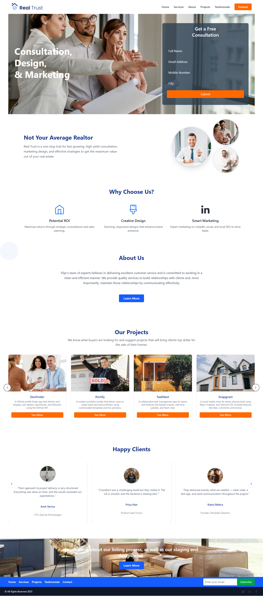

# Full Stack Landing Page Application

This is a full-stack web application featuring a modern, responsive landing page built with React and Vite on the frontend, and Node.js with Express and MongoDB on the backend.

It includes dynamic project listings, client testimonials, contact and newsletter forms, and admin upload functionality — all connected via REST APIs.


## 📌 Features

### ✅ Frontend (React + Vite + Tailwind CSS)
- Fully responsive landing page UI
- Project showcase grid (fetched from backend)
- Client testimonials carousel using `keen-slider`
- Contact and Newsletter forms with backend integration
- Admin panel for uploading new projects/clients
- Image cropping with fixed ratio (450x350) using `react-easy-crop`

### ✅ Backend (Node.js + Express + MongoDB)
- RESTful APIs for:
  - Projects (GET, POST)
  - Clients (GET, POST)
  - Contacts (POST)
  - Newsletter Subscribers (POST)
- MongoDB integration using Mongoose
- Environment variable support via `.env`

---

## 🗂 Folder Structure

root/
├── client/ # Frontend (React + Vite)
├── server/ # Backend (Node.js + Express)
└── README.md


---

## 🚀 Setup Instructions (Local)

### ✅ Prerequisites
- Node.js (v16+)
- MongoDB (Atlas or local)
- Git

### ✅ 1. Clone the Repository

```bash
git clone https://github.com/your-username/your-repo-name.git
cd your-repo-name


Backend Setup (server/)

cd server
npm install
Create a .env file:
MONGO_URI=your_mongodb_connection_string
npm run dev


Frontend Setup (client/)
cd ../client
npm install
npm run dev

### 🖼️ UI Preview

#### 🔹 Landing Page



#### 🔹 Admin Panel


